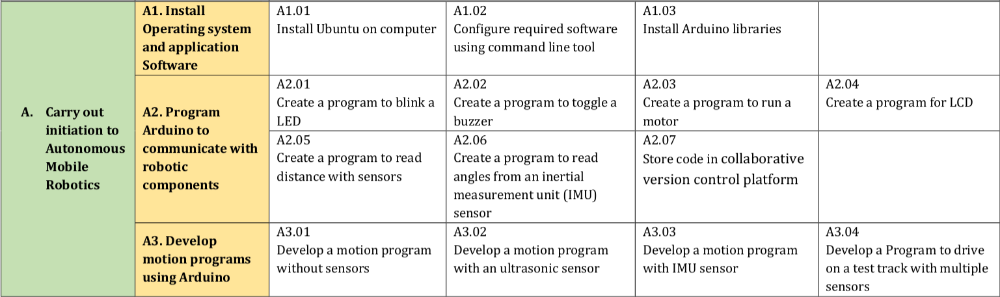
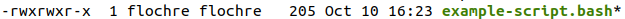

# apex-appraisal
First Evalution for the module A

Welcome to the evaluation of Module A



Before you start, I will ask you to make a fresh install of you ubuntu computer.

A USB Stick with Ubuntu in it is at your disposal.
If you happens to have a computer with SecureBoot don't hesitate to ask for help after the first reboot

You might want to connect to Github and get you bash script for installing software automatically

If you use such a script, please make sure it is executable with the x function

```
chmod +x your_script
```

for example in this folder example-script.bash is not executable

```
$ ll
total 68
drwxrwxr-x 11 flochre flochre  4096 Oct 10 16:20 ./
drwxrwxr-x  8 flochre flochre  4096 Oct 10 14:38 ../
-rw-rw-r--  1 flochre flochre   205 Oct 10 16:23 example-script.bash
drwxrwxr-x  3 flochre flochre  4096 Oct 10 16:01 exercice_1/
drwxrwxr-x  2 flochre flochre  4096 Oct 10 14:58 exercice_2/
drwxrwxr-x  2 flochre flochre  4096 Oct 10 14:58 exercice_3/
drwxrwxr-x  2 flochre flochre  4096 Oct 10 14:58 exercice_4/
drwxrwxr-x  8 flochre flochre  4096 Oct 10 16:20 .git/
-rw-rw-r--  1 flochre flochre   270 Oct 10 14:38 .gitignore
drwxrwxr-x  2 flochre flochre  4096 Oct 10 16:09 img/
-rw-rw-r--  1 flochre flochre 11357 Oct 10 14:38 LICENSE
-rw-rw-r--  1 flochre flochre   896 Oct 10 16:22 README.md
drwxrwxr-x  2 flochre flochre  4096 Oct 10 14:58 step_1/
drwxrwxr-x  2 flochre flochre  4096 Oct 10 14:58 step_2/
drwxrwxr-x  2 flochre flochre  4096 Oct 10 14:58 step_3/
```

You can make it executable
```
chmod +x example-script.bash
```

```
ll
```
You should now see a x and the file should change color.


And now you can try it
```
./example-script.bash
```

Once you did that you can call the teacher and let him check it. Before you go one with the exercices.

You should now configure github to work on your computer.

```
gh auth login
gh setup-git
```

And you should clone the repository

I advise you to create a folder for this:
```
mkdir ~/workspace
cd ~/workspace
gh repo clone TTTRC-Robotics/<your-appraisal-repo> # note this one is unique for you
```

## Exercices

### Exercice 1 - Use the command line tool
Go to [exercice_1](exercice_1)

Correction of [exercice_1](https://github.com/TTTRC-Robotics/apex-appraisal-correction/issues/1)

### Exercice 2 - Create a function
Go to [exercice_2](exercice_2)

Correction of [exercice_2](https://github.com/TTTRC-Robotics/apex-appraisal-correction/pull/3)
Commando given for [exercice_2](https://github.com/TTTRC-Robotics/apex-appraisal-correction/issues/2)


### Exercice 3 - Explain some code
Go to [exercice_3](exercice_3)

Correction of [exercice_3](https://github.com/TTTRC-Robotics/apex-appraisal-correction/pull/5)
Commando given for [exercice_3](https://github.com/TTTRC-Robotics/apex-appraisal-correction/issues/4)

### Exercice 4 - Generate a Arduino Code from zero
Go to [exercice_4](exercice_4)

Correction of [exercice_4](https://github.com/TTTRC-Robotics/apex-appraisal-correction/pull/7)
Commando given for [exercice_4](https://github.com/TTTRC-Robotics/apex-appraisal-correction/issues/6)

## Test track run

### Step 1 - Upload the code to Github


To be able to evaluate the work you will generate a issue and store all the info inside it.

1. Give it the Title : Driving Code
1. Give it the comment : Upload the code of a Driving Robot
1. Submit it

You should then create a branch from inside the issue


Then make sure you are in your repository and do :
```
git fetch origin
git checkout 5-driving-code   # note: you branch name could be a little bit different
```

Copy your code of the Robot inside the folder
add the file
commit and push

### Step 2 - Explaination of the robot behavior

You should explain your expectation of what the robot will be doing during the drive and explain a bit about the difficulties you had writting the code
### Step 3 - Run on the track

- The teacher will get your code online and flash it to the car.
- The drive should last 1 minutes 30 secondes
- The Robot should do what you said
- The Robot should not dramasticly hit the wall
- Hiting the wall in diagonale, with the angle were the USS do not see anything will not be considered
- The test Track will be separated into 6 areas, the robot should go on all 6 areas
- The robot should not stop moving longer than 4 secondes.
