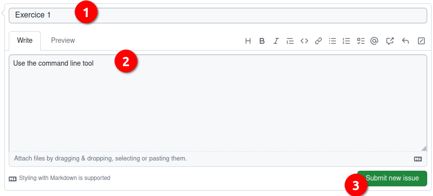
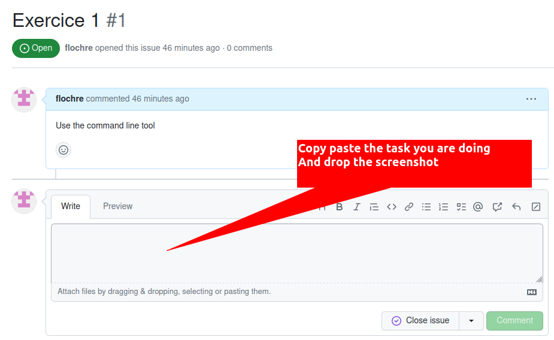
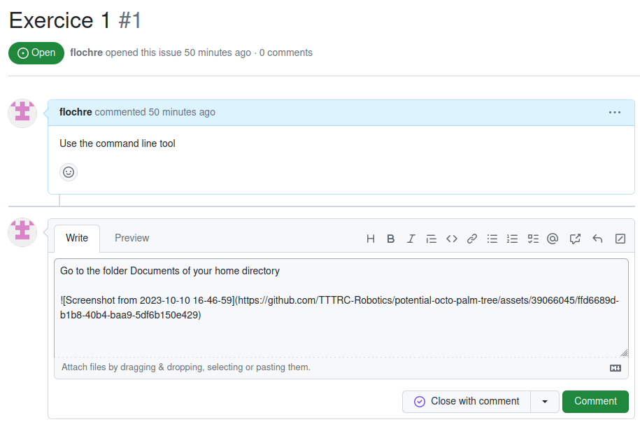
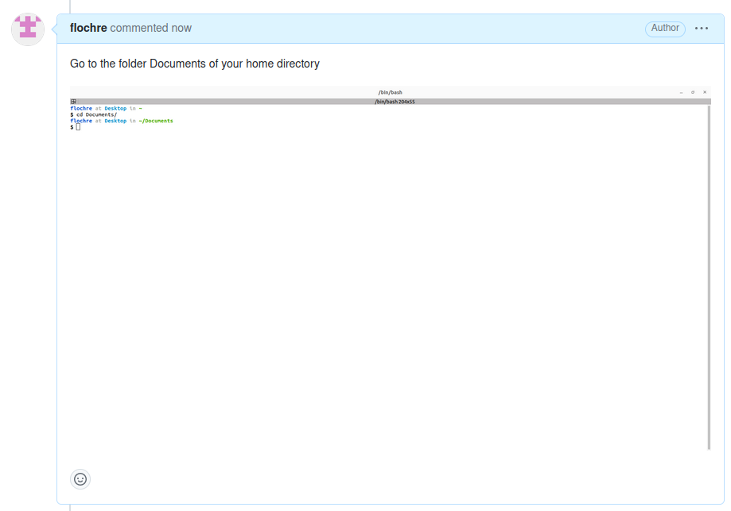

# Exercice 1

In this exercice you will be ask to prove your skills using the terminal

But first I will ask a you to generate a issue in Github with Firefox

## Generate a issue in this repository

To be able to evaluate the work you will generate a issue and store all the info inside it.

1. Give it the Title : Exercice 1
1. Give it the comment : Use the command line tool
1. Submit it

## Use the command line tool

For each of the items now, you will be asked to do the task and make a screenshot of the result

### Example

- Go to the folder Documents of your home directory

1. Open you terminal
2. Enter the necessary commands
3. Take a screenshot
4. Add the task and the screenshot to the issue Exercice 1

Add the text and image

after commenting, it should look like this

### Exercice

- Go to the your-appraisal-repo folder   # this is this repo that you should have cloned already
- make a list of the files in your-appraisal-repo
- make a detail list of the files in your-appraisal-repo
- Go to the folder Downloads of your home directory
- Go to the folder /tmp
- Create a directory inside the /tmp folder named empty_sketch
- Create a empty_sketch.ino file inside the empty_sketch folder
- Go back to /tmp folder and move the folder empty_sketch containing the file  empty_sketch.ino into the folder Documents of your home directory
- Go to the folder Documents of your home directory and remove the folder empty_sketch and the file simultaniously
- Echo the path of the home directory
- Echo your username
- Show me the manual of the function pwd
- Show me the help of the function pwd

Go to [exercice_2](../exercice_2)