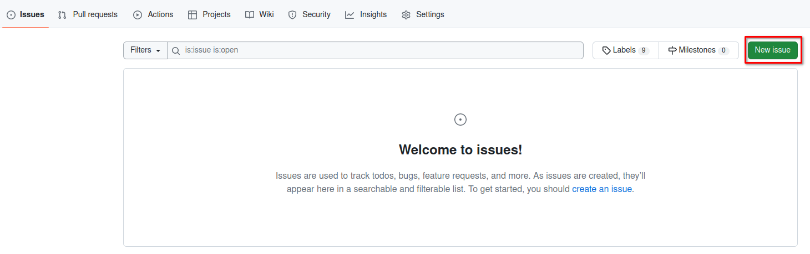

# Exercice 2 

In this exercice, we will make sure, that you are able to create a function and use it.

But first I will ask a you to generate a issue in Github with Firefox

## Generate a issue in this repository



To be able to evaluate the work you will generate a issue and store all the info inside it.

1. Give it the Title : Exercice 2
1. Give it the comment : Create a function
1. Submit it

You should then create a branch from inside the issue


Then make sure you are in your repository and do :
```
cd ~/workspace/apex-appraisal-yourGhName
git fetch origin
git checkout 2-exercice-2   # note: you branch name could be a little bit different
```

You should now be in the new branch
you can check it with 
```bash
$ git status
On branch 2-exercice-2
Your branch is up to date with 'origin/2-exercice-2'.
```

## Create a function

Please make sure you commit and push after each fonction created

There is a file exercice_2/exercice2.ino

You should edit it and add the following functions into it.


- a function called do_nothing with:
  - no parameters
  - no return value
  - no line of code

Once done: 
- make sure the code compiles
- commit you code 
```bash
git add exercice_2/exercice_2.ino # this is an exemple could be a little bit different
git commit -m"add function do_nothing"
git push
```
- push your code

You should edit exercice_2/exercice_2.ino again and add the following functions into it.

- a function called multiplication with:
  - two int parameters called : number and factor
  - return a int
  - code should calculate the product of the 2 parameters

Once done: 
- make sure the code compiles
- commit and push you code 
```bash
git add exercice_2/exercice_2.ino # this is an exemple could be a little bit different
git commit -m"add function multiplication"
git push
```

You should edit exercice_2/exercice_2.ino again and add the following functions into it.

- a function called substraction with:
  - two int parameters called : number and decrement
  - return a int
  - code should calculate the substraction of the 2 parameters

Once done: 
- make sure the code compiles
- commit you code 
```bash
git add exercice_2/exercice_2.ino # this is an exemple could be a little bit different
git commit -m"add function substraction"
git push
```

## Create a pull request

In you pull request you should see at least 3 commits

- Give the name : Resolving Exercice_2
- Let me know any problem you add in the comments
- Create pull request 


Go to [exercice_3](../exercice_3)