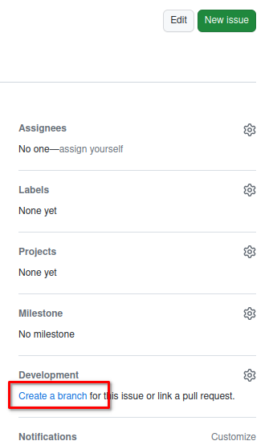
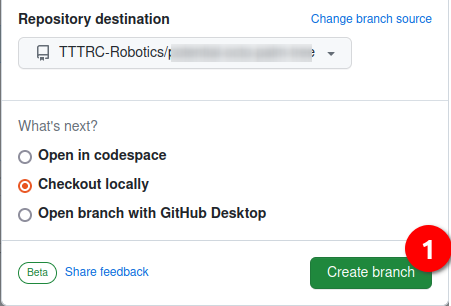

# Exercice 3

In this exercice, we will make sure, that you are able to explain some code.

But first I will ask a you to generate a issue in Github with Firefox

## Generate a issue in this repository


To be able to evaluate the work you will generate a issue and store all the info inside it.

1. Give it the Title : Exercice 3
1. Give it the comment : Explain some code
1. Submit it

You should then create a branch from inside the issue




Then make sure you are in your repository and do :
```
git fetch origin
git checkout 3-exercice-3   # note: you branch name could be a little bit different
```

## Explain some code

Inside the exercice_3 folder you will find folders with arduino code.

This codes has no comments and you should add comments to the code to explain what the code is doing.

Please for each folder you should:
- read the code
- comment it
- commit and push the changes you made

## Create a pull request

In you pull request you should see at least 2 commits

- Give the name : Resolving Exercice_3
- Let me know any problem you add in the comments
- Create pull request 


Go to [exercice_4](../exercice_4)