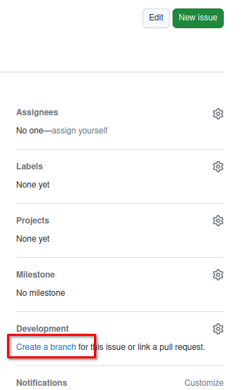
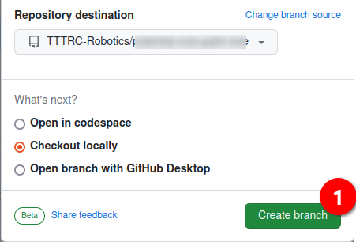
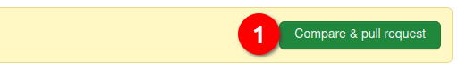

# Exercice 4

In this exercice, we will make sure, that you are able to Create a Arduino Sketch from zero.

But first I will ask a you to generate a issue in Github with Firefox

## Generate a issue in this repository


To be able to evaluate the work you will generate a issue and store all the info inside it.

1. Give it the Title : Exercice 4
1. Give it the comment : Create a Arduino Sketch from zero
1. Submit it

You should then create a branch from inside the issue




Then make sure you are in your repository and do :
```
git fetch origin
git checkout 4-exercice-4   # note: you branch name could be a little bit different
```

## Generate the minimum Arduino Sketch

Inside the exercice_4 folder you should generate the minimum arduino sketch that compiles.

Please commit and push this code in the new branch

## Create a pull request

In you pull request you should see at least 2 commits

- Give the name : Resolving Exercice_4
- Let me know any problem you add in the comments
- Create pull request 



Go to Lunch after telling the teacher you are done.
:stew::pizza::poultry_leg::egg::meat_on_bone::fork_and_knife: